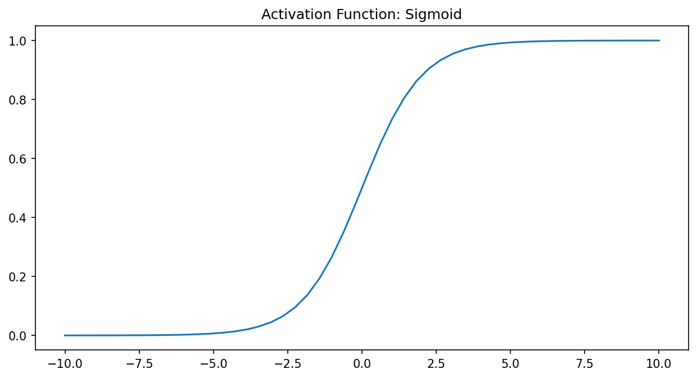

Deep Learning
=============

This repo is a quick reference for Deep Learning.
PyTorch is used as Deep Learning framework for experimenting.

Table of Contents
-----------------

- `Activation Functions <activation-functions_>`_

.. _activation-functions:

Activation Functions
--------------------

+---------------+---------------------------------------------+-----------------+
|Name           |Function                                     |Python           |
+===============+=============================================+=================+
|Sigmoid        |:math:`sigmoid(x) = \frac{1}{( 1 + e^{-x} )}`|1/(1+np.exp(-x)) |
+---------------+---------------------------------------------+-----------------+
|ReLU           |:math:`relu(x) = max(0,x)`                   |max(0,x)         | 
+---------------+---------------------------------------------+-----------------+
|               |                                             |                 |
|Tanh           |:math:`tanh(x) = \frac{sinh(x)}{cosh(x)}`    |max(0,x)         | 
|               |                                             |                 |
+---------------+---------------------------------------------+-----------------+
|Binary Step    |:math:`binarystep(x) = max(0,x)`             |np.heaviside(x,1)|
+---------------+---------------------------------------------+-----------------+

